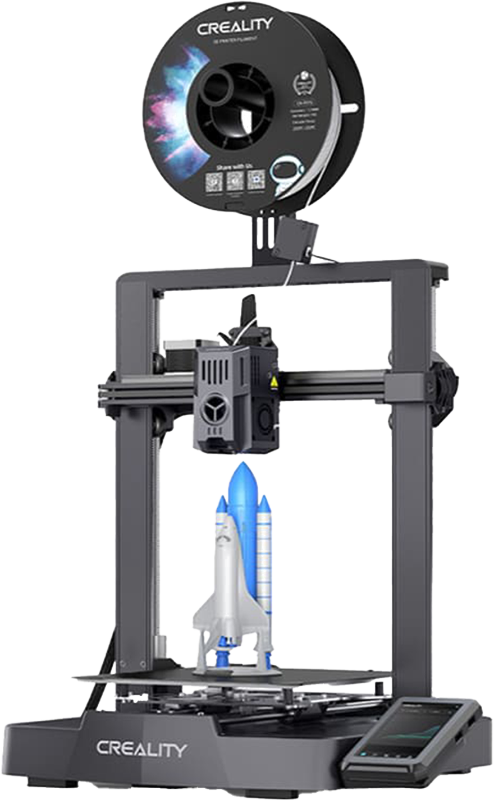

# 3D Projects Repository

Welcome to my 3D Projects! This is a journal where I document my 3D printing and modeling practice. It's a way for me to keep track of what I do, share my progress, and hopefully provide useful insights for others.

## Printer

I have an [Ender 3 V3 KE](https://www.creality3dofficial.com/products/creality-store-ender-3-v3-ke-3d-printer-on-sale).

The only changes to it have been:

- Removing the spool holder and feed directly from a dryer box ([Creality Filament Dry Box 2.0](https://store.creality.com/products/creality-filament-dry-box-2-0))
- Replace the stock bed with a [PEI sheet](https://a.co/d/eMivClM)

## Project List

- [chess](./projects/chess/README.md)
