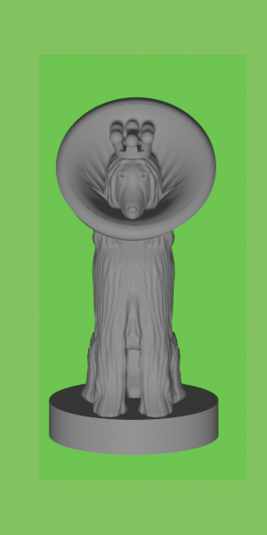
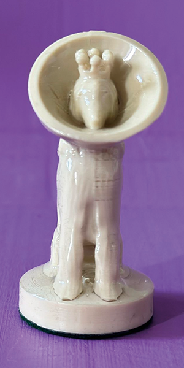
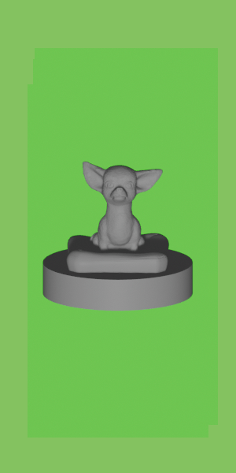
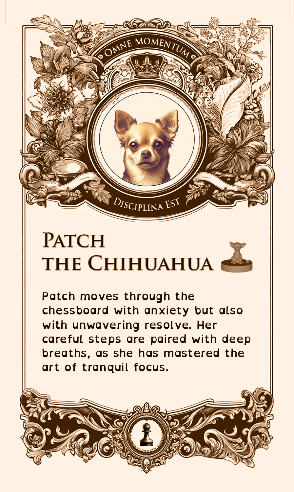

# El Joc d'Escacs de Gossos Amb Capacitats Diferents

> Traduccions generades en  . Original en 

Aquest projecte és un homenatge a la meva entrenadora de gossos, Casey Buckley, que dirigeix [WP Creative Pets](https://www.wpcreativepets.com/). Si teniu un gos, especialment reactiu, i esteu a la zona de Filadèlfia, no trobareu millor entrenadora. S'adapta fàcilment a diferents estils d'ensenyament, té coneixements sobre traumes, és amigable amb la comunitat queer i és extremadament talentosa.

## Història

El nostre gos, Iroh, tenia problemes d'ansietat que no podíem superar fins que la vam contactar. Aquí està ara, sent un bon noi:

    

Com a agraïment pel treball incansable de Casey i el seu impacte en Iroh, volia fer un projecte en 3D que servís tant per a practicar, ja que estic aprenent la impressió 3D, com per a honrar la seva feina. Sabent que ella col·lecciona jocs d'escacs únics, vaig decidir construir un joc d'escacs personalitzat amb gossos amb discapacitats. Era important que aquests es mostressin amb normalitat i enfocats en el positiu en lloc de qualsevol aspecte limitant, ja que això capturaria més precisament el seu enfocament i la seva feina.

## Peces d'Escacs

Vaig trobar [aquest joc d'escacs](https://www.thingiverse.com/thing:5590380) a Thingiverse que era tan adorable com un bon punt de partida.

    

### Ideació i Disseny del Model 3D

La idea era crear un conjunt que no només representés diferents races de gossos, sinó que també destacés diverses discapacitats d'una manera positiva i inclusiva. Volia destacar una àmplia gamma de discapacitats per fer el conjunt tan inclusiu i representatiu com fos possible. Aquestes discapacitats van ser triades per reflectir tant condicions visibles com invisibles, temporals i permanents, amb l'objectiu de crear consciència a través dels escacs.

| Peça d'Escacs | Discapacitat | Ajuda Adaptativa |
| - | - | - |
| Rei | Amputació de la pota davantera | Pròtesi |
| Reina | Discapacitat temporal (Post-cirurgia) | Coll |
| Alfil | Paràlisi | Cadira de rodes |
| Cavaller | Ceguera | Halo |
| Torre | Artritis | Rampa, matalàs ortopèdic |
| Peons 1 i 2 | Trastorn de deglució | Biberó |
| Peons 3 i 4 | Discapacitat invisible | N/A |
| Peons 5 i 6 | Trastorn d'ansietat | Medicació |
| Peons 7 i 8 | Malaltia degenerativa del disc | Llit ortopèdic |

El següent pas era esbrinar com representar aquestes discapacitats en els models. Vaig incorporar alguns dissenys addicionals de Thingiverse en el projecte i vaig crear la resta.

Per exemple, la cadira de rodes de l'alfil es basava en [aquest model](https://www.thingiverse.com/thing:1397964):

El render final es veia així:

![Fila de peces d'escacs negres renderitzades en 3D semblants a gossos amb capacitats diferents en bases rodones, col·locades sobre un fons verd brillant. D'esquerra a dreta: un gos amb una pròtesi i una corona, un gos amb un coll i una corona, un gos en una cadira de rodes, un gos amb un halo, un gos en una caseta amb una rampa accessible, i cinc gossos petits en diverses posicions, un amb un biberó, un amb pastilles, un assegut en un llit ortopèdic. Aquestes peces representen el joc d'escacs de gossos amb capacitats diferents personalitzat.](./images/render/all.png)

### Procés d'Impressió 3D

Per aconseguir els millors resultats, vaig utilitzar una altura de capa petita de 0,12 mm per capturar petits detalls. Les peces estan impreses sòlides, fent-les més pesades i duradores.

Va caldre un parell d'iteracions per esbrinar com imprimir-les millor; algunes, com el rei i l'alfil, es van imprimir millor sense suports. Altres, com la reina (per al coll) i el cavaller (per al halo), els necessitaven.

Com que moltes tenien detalls delicats (com el halo del cavaller), vaig decidir recobrir-les amb resina UV transparent per augmentar la seva resistència.

### Ús de la Resina UV

L'ús de resina UV enforteix les peces, però requereix precaucions de seguretat com portar equip de protecció. El procés és senzill però requereix una mica de preparació. Seguiu les instruccions de la resina per al temps de curat per evitar un sobrecurat. Assegureu-vos de no mirar directament la llum UV i eviteu el contacte de la resina amb la pell.

| Material | Imatge |
| - | - |
| [Resina UV](https://a.co/d/ezitsoy) |  |
| [Llum UV](https://a.co/d/ezitsoy) |  |
| [Goggles de Protecció](https://a.co/d/0IKj0s0) |  |
| [Guants de Protecció](https://a.co/d/9HWPJkN) |  |
| [Bata de Protecció](https://a.co/d/4McWedg) |  |

Després de l'aplicació de la resina, i per assegurar-me que les peces llisquessin bé pel tauler d'escacs, vaig utilitzar [feltre verd](https://a.co/d/2bVIOpZ).

### Peces Finals d'Escacs

Aquí teniu el resultat final:

| Peça d'Escacs | Discapacitat | Render 3D | Imprès |
| - | - | - | - |
| Rei | Amputació |  |  |
| Reina | Temporal / Post-cirurgia |  |  |
| Alfil | Paràlisi |  |  |
| Cavaller | Ceguera |  |  |
| Torre | Artritis |  |  |
| Peons 1 i 2 | Trastorn de deglució |  |  |
| Peons 3 i 4 | Discapacitat invisible |  |  |
| Peons 5 i 6 | Trastorn d'ansietat |  |  |
| Peons 7 i 8 | Malaltia degenerativa del disc |  |  |

## Targetes

L'objectiu de les targetes era fer les discapacitats mostrades en les peces d'escacs més clares mentre les destacava d'una manera positiva o neutral, no com una limitació sinó simplement com a part de la vida del gos.

Després d'explorar diferents estils, vaig triar un aspecte adornat i antic.

| Antic | Eco-Friendly | Modern |
| - | - | - |
|  |  |  |

Com que el lema de WP Creative Pets és "Cada Moment és un Moment d'Entrenament," volia incorporar-lo com a part del conjunt de targetes. Amb una mica d'ajuda de ChatGPT, vaig arribar a la traducció aproximada al llatí de "Omne Momentum Disciplina Est."

    

### Fonts i Disseny

Pel que fa a les fonts, vaig triar Trajan Pro tant per al lema com per al títol, ja que semblava combinar bé amb l'estil de la targeta. OpenDyslexicAlta per al cos va ser triada per la seva llegibilitat i accessibilitat, especialment perquè tot l'exercici és no estar limitat per discapacitats.

| Trajan Pro | Open Dyslexic Alta |
| - | - |
|  |  |

### Detalls de les Targetes

| Peça d'Escacs | Targeta |
| - | - |
| Rei |  |
| Reina |  |
| Alfil |  |
| Cavaller |  |
| Torre |  |
| Peons 1 i 2 |  |
| Peons 3 i 4 |  |
| Peons 5 i 6 |  |
| Peons 7 i 8 |  |

El dors era el mateix per a totes les targetes:

| Disseny | Imprès |
| - | - |
|  |  |

Un cop dissenyades, les targetes es van fer a [MakePlayingCards.com](https://www.makeplayingcards.com/design/custom-us-game-deck-size-cards.html). El fitxer de Photoshop que inclou totes les variacions de targetes i la plantilla de MakePlayingCards.com està disponible [aquí](./assets/tarot-size.psd). Es van imprimir en plàstic d'alta qualitat i es van tallar i enviar les targetes.

Una iteració més antiga de les targetes també està disponible [aquí](./assets/us_game_deck.psd), però vaig decidir no utilitzar-la degut a la seva mida més petita, que afectava la llegibilitat, i

 en última instància, no estava satisfet amb el meu primer disseny. Si teniu curiositat, així es veien:

| Imprès | Davant | Dors |
| - | - | - |
|  |  |  |

## Tauler

El tauler d'escacs està dissenyat per representar un parc de gossos, amb la meitat de les rajoles representant "sorra" i l'altra meitat "herba," envoltades per una carretera.

### Disseny i Construcció del Tauler

El tauler d'escacs representa un parc de gossos amb rajoles d'herba i sorra, envoltades per una carretera. Les rajoles es van imprimir amb textures detallades per imitar superfícies reals. El tauler d'escacs està compost per quatre quadrants, cadascun repetit dues vegades:

La representació de l'herba va requerir diverses iteracions, finalment arribant a aquest patró que es va imprimir com una petita sèrie de fils prims semblants a cabells. Els forats es van omplir amb les rajoles de sorra, que es van imprimir verticalment per obtenir millor resolució.

Un cop els quatre quadrants d'herba es van imprimir i omplir amb les rajoles de sorra, els vaig enganxar al seu lloc a sobre d'una làmina de metall per donar-los una sensació de pes. Vaig utilitzar aliatge d'alumini 6061 de <https://www.onlinemetals.com>, que ofereix talls personalitzats, permetent-me demanar una làmina pre-tallada.

Per a la vora, vaig utilitzar [aquestes rajoles](https://www.thingiverse.com/thing:2480607) de Thingiverse que ja semblaven paviment i vaig afegir diferents escenes amb gossos relaxant-se, jugant i intentant agafar ossos i fruita.

| Pou d'Os | Lladre de Pastanagues | Chihuahua Relaxat | Reunió de Gossos |
| - | - | - | - |
|  | ![Primer pla d'una secció de cantonada del tauler d'escacs amb temàtica de parc de gossos, mostrant camins de llambordes grisos amb figures de gossos i diversos objectes. Dues figures de gossos, una dempeus amb una pastanaga a la boca i una asseguda, estan col·locades a prop de caixes plenes de menjar. Les caixes i els gossos afegeixen una escena realista a la cantonada. Al fons, el patró de quadres d'herba verda i sorra blanca alternades és visible, proporcionant un contrast vibrant amb el camí gris i les figures.](./images/board/side-boxes.jpeg) |  |  |

Vaig intentar cobrir les esquerdes entre els quadrants utilitzant un bolígraf 3D i llimant l'excés, però encara eren força visibles.

Finalment, vaig cobrir la superfície amb resina UV novament. M'agradaria haver tingut en compte les esquerdes perquè van causar algunes bombolles grans. La resina escalfada també va dissoldre els fils d'herba, cosa que va ser desafortunada. Podeu veure com es veia amb i sense resina a continuació:

| Amb Resina | Sense Resina |
| - | - |
|  |  |

## Caixa del Tauler

No podia utilitzar la impressora 3D per a la caixa ja que era molt més gran que el tauler d'escacs. Fer-la d'una sola peça sòlida assegura que pot aguantar el tauler d'escacs de manera fiable.

Com que el tauler d'escacs és de 13,75"x13,75", vaig reutilitzar una caixa de pizza de 14". La vaig pintar de porpra i vaig estarcir una peça d'escacs amb cap de gos com a logotip. Per a protecció, vaig afegir una capa de [poliacrílic](https://a.co/d/cTNn0YK) transparent. Podeu veure el procés a continuació:

| Pas | Imatge |
| - | - |
| Disseny Inicial |  |
| Crear estergit |  |
| Pintura amb Spray |  |
| Pintat |  |

Per a l'interior, volia afegir un cartell en Braille ja que tenim un gos cec en el joc d'escacs. El text inclou un enllaç a aquesta publicació. Vaig utilitzar <https://touchsee.me> per generar els fitxers STL per a Braille contractat (Grau 2) perquè el text digui:

| Text Pla | Contractat | Braille | Render | Assemblat |
| - | - | - | - | - |
|  |  ,b>tra = ,casey ,buckley1 ,,wp ,cr1tive ,pets1 & all h} pets4 ,le>n m at3 bit4ly_/dog*ess'" /> |  |  |  |

Van ser necessaris diversos intents per aconseguir un text en braille clar. També hi ha un codi QR que enllaça a aquesta pàgina. El vaig generar utilitzant <https://printer.tools/qrcode2stl>. Malauradament, no vaig poder imprimir-lo de manera que quedés prou bé per incloure'l al tauler. Finalment, vaig fer una targeta addicional amb el codi QR en lloc.

| Render | Resultat | Targeta |
| - | - | - |
|  |  |  |

Tant per al braille com per al codi QR, vaig haver d'afegir una pausa per canviar el filament ja que la meva impressora no suporta impressions multi-material. Per fer-ho, afegiu `M600` al codi G generat on ha de produir-se la pausa. Si teniu curiositat sobre què passa quan afegiu la pausa a la capa incorrecta, podeu veure-ho aquí:

![Fotografia d'una impressió 3D fallida d'un text en braille sobre una superfície de fusta. La impressió té una capa superior negra amb punts de braille visibles, però el canvi de color del filament s'ha aplicat incorrectament, resultant en el filament negre utilitzat a la última capa de la part base en lloc de la capa prevista. La taula està emmarcada per un marc porpra, i la superfície sembla irregular i desordenada degut al problema de canvi de capa del color del filament. El text en braille és difícil de llegir per culpa de l'error de capa.](./images/braille/attempt-layer.png)

Finalment, vaig utilitzar el mateix feltre que per a les peces d'escacs per cobrir la part inferior de l'interior de la caixa.

## Suport de les Peces

Per mantenir les peces organitzades i protegides, vaig dissenyar una caixa personalitzada. És una mica voluminosa, però volia que el suport interior també servís com a base per a les peces perquè es poguessin mostrar més fàcilment. La caixa és un cub quadrat amb un insert interior destinat a ajudar a minimitzar el moviment de les peces. La part frontal de la caixa té una tapa que es llisca i té la mateixa imatge de la peça d'escacs amb cap de gos que vam estergir per la caixa del tauler.

| Disseny | Obert | Parcialment Obert | Tancat |
| - | - | - | - |
|  |  |  |  |

### Resum

I això és tot! Gràcies per prendre't el temps de llegir sobre el Joc d'Escacs amb Capacitats Diferents.

| Targetes | Peces d'Escacs | Tauler | Caixa del Tauler | Caixa de Peces |
| - | - | - | - | - |
|  |  |  |  |  |

Si vols deixar un comentari o suggeriment, ho pots fer [aquí](https://github.com/obartra/3d/issues/new).

