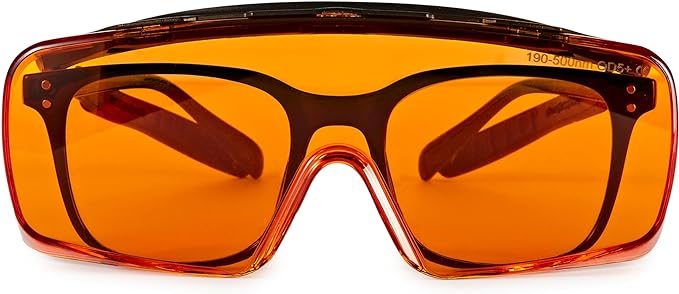
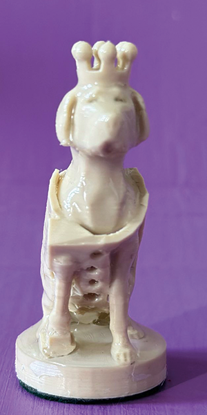
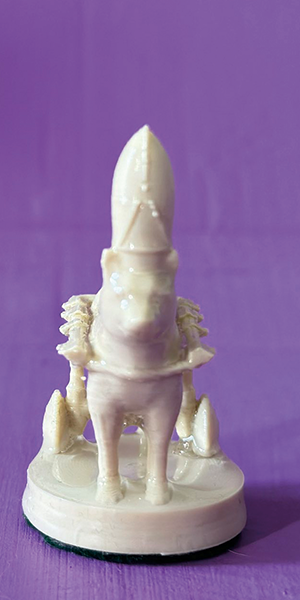
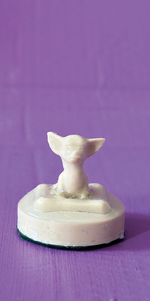
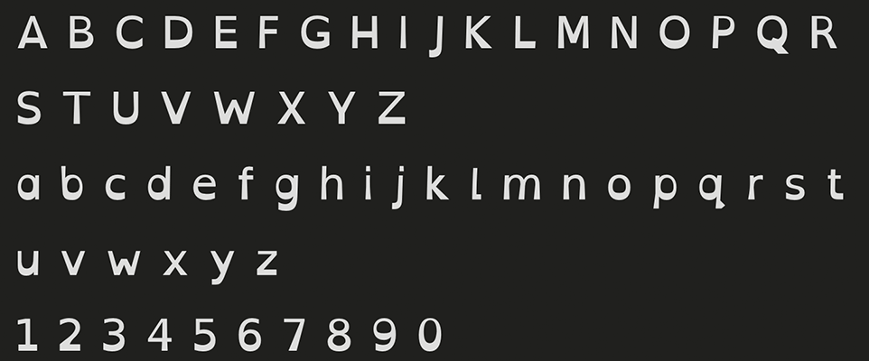
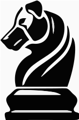
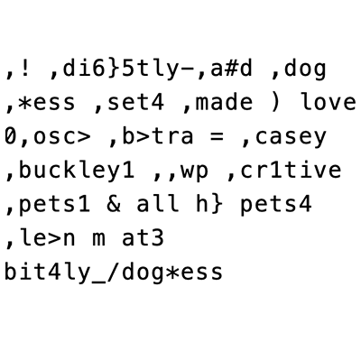
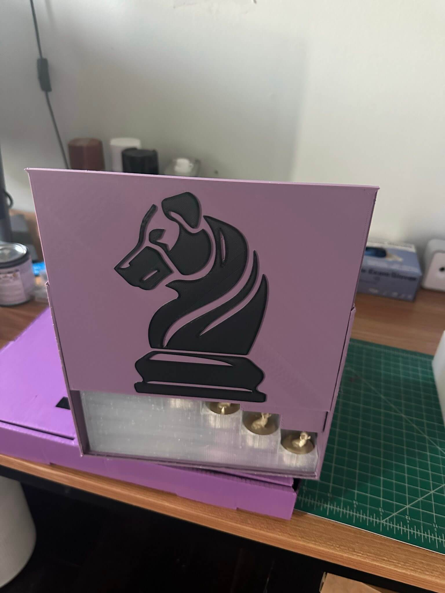

# El Juego de Ajedrez de Perros con Capacidades Diferentes

> Traducciones generadas en  . Original en 

Este proyecto es un tributo a mi entrenadora de perros, Casey Buckley, quien dirige [WP Creative Pets](https://www.wpcreativepets.com/). Si tienes un perro, especialmente uno reactivo, y estás en el área de Filadelfia, no encontrarás mejor entrenadora. Ella se adapta fácilmente a diferentes estilos de enseñanza, está informada sobre traumas, es amigable con la comunidad queer y extremadamente talentosa.

## Historia

Nuestro perro, Iroh, tenía algunos problemas de ansiedad que no pudimos superar hasta que la contactamos. Aquí está ahora, siendo un buen chico:

    

Como agradecimiento por el incansable trabajo de Casey y su impacto en Iroh, quise hacer un proyecto en 3D que sirviera tanto como práctica para mí, ya que estoy aprendiendo a imprimir en 3D, y para honrar su trabajo. Sabiendo que ella colecciona juegos de ajedrez únicos, decidí construirle un juego de ajedrez personalizado con perros con discapacidades. Era importante que estos se mostraran con normalidad y enfocándose en lo positivo en lugar de cualquier aspecto limitante, ya que eso capturaría más precisamente su enfoque y su trabajo.

## Piezas de Ajedrez

Encontré [este juego de ajedrez](https://www.thingiverse.com/thing:5590380) en Thingiverse que era adorable y un excelente punto de partida.

    

### Ideación y Diseño del Modelo 3D

La idea era crear un conjunto que no solo representara diferentes razas de perros, sino que también destacara diversas discapacidades de manera positiva e inclusiva. Quería resaltar una gama diversa de discapacidades para hacer el conjunto lo más inclusivo y representativo posible. Estas discapacidades fueron elegidas para reflejar tanto condiciones visibles como invisibles, temporales y permanentes, con el objetivo de crear conciencia a través del ajedrez.

| Pieza de Ajedrez | Discapacidad | Ayuda Adaptativa |
| - | - | - |
| Rey | Amputación de pata delantera | Pierna protésica |
| Reina | Discapacidad temporal (post-cirugía) | Cono |
| Alfil | Parálisis | Silla de ruedas |
| Caballo | Ceguera | Halo |
| Torre | Artritis | Rampa, alfombra ortopédica |
| Peones 1 y 2 | Trastorno de deglución | Biberón |
| Peones 3 y 4 | Discapacidad invisible | N/A |
| Peones 5 y 6 | Trastorno de ansiedad | Medicación |
| Peones 7 y 8 | Enfermedad degenerativa del disco | Cama ortopédica |

El siguiente paso fue averiguar cómo representar estas discapacidades en los modelos. Incorporé algunos diseños adicionales de Thingiverse en el proyecto y creé el resto.

Por ejemplo, la silla de ruedas del alfil se basó en [este modelo](https://www.thingiverse.com/thing:1397964):

El renderizado final se veía así:

![Fila de piezas de ajedrez en 3D renderizadas en negro, que se asemejan a perros con habilidades diferentes, sobre bases redondas, colocadas en un fondo verde brillante. De izquierda a derecha: un perro con una pierna protésica y corona, un perro con un cono y corona, un perro en silla de ruedas, un perro con un halo, un perro en una caseta con rampa accesible, y cinco perros pequeños en varias poses, uno con un biberón, otro con pastillas, otro sentado en una cama ortopédica. Estas piezas representan el juego de ajedrez de perros con habilidades diferentes personalizado](./images/render/all.png)

### Proceso de Impresión 3D

Para lograr los mejores resultados, utilicé una altura de capa pequeña de 0.12mm para capturar pequeños detalles. Las piezas se imprimen sólidas, haciéndolas más pesadas y duraderas.

Tomó un par de iteraciones averiguar cómo imprimirlas mejor; algunas, como el rey y el alfil, se imprimieron mejor sin soportes. Otras, como la reina (por el cono) y el caballo (por el halo), los necesitaron.

Dado que muchas tenían detalles delicados (como el halo del caballo), decidí recubrirlas con resina UV transparente para aumentar su resistencia.

### Uso de Resina UV

El uso de resina UV fortalece las piezas pero requiere precauciones de seguridad, como usar equipo de protección. El proceso es sencillo pero requiere cierta preparación. Sigue las instrucciones de la resina para el tiempo de curado para evitar el sobrecurado. Asegúrate de no mirar directamente a la luz UV y evitar el contacto de la piel con la resina.

| Material | Imagen |
| - | - |
| [Resina UV](https://a.co/d/ezitsoy) |  |
| [Luz UV](https://a.co/d/ezitsoy) |  |
| [Gafas de Protección](https://a.co/d/0IKj0s0) |  |
| [Guantes de Protección](https://a.co/d/9HWPJkN) |  |
| [Bata de Protección](https://a.co/d/4McWedg) |  |

Después de aplicar la resina, y para asegurarme de que las piezas se deslizaran bien en el tablero de ajedrez, usé [fieltro verde](https://a.co/d/2bVIOpZ).

### Piezas de Ajedrez Finales

Aquí está el resultado final:

| Pieza de Ajedrez | Discapacidad | Render 3D | Impreso |
| - | - | - | - |
| Rey | Amputación |  |  |
| Reina | Temporal / Post-cirugía |  |  |
| Alfil | Parálisis |  |  |
| Caballo | Ceguera |  |  |
| Torre | Artritis |  |  |
| Peones 1 y 2 | Trastorno de deglución |  |  |
| Peones 3 y 4 | Discapacidad invisible |  |  |
| Peones 5 y 6 | Trastorno de ansiedad |  |  |
| Peones 7 y 8 | Enfermedad degenerativa del disco |  |  |

## Tarjetas

El objetivo de las tarjetas era hacer más claras las discapacidades mostradas en las piezas de ajedrez mientras se destacaban de manera positiva o neutral, no como una limitación, sino simplemente como parte de la vida del perro.

Después de explorar diferentes estilos, elegí un aspecto ornamentado y antiguo.

| Antiguo | Ecológico | Moderno |
| - | - | - |
|  |  |  |

Como el lema de WP Creative Pets es "Cada Momento es un Momento de Entrenamiento", quise incorporarlo como parte del conjunto de tarjetas. Con algo de ayuda de ChatGPT, llegué a la traducción aproximada en latín de "Omne Momentum Disciplina Est."

    

### Fuentes y Diseño

En cuanto a las fuentes, elegí Trajan Pro tanto para el lema como para el título, ya que parecía combinar bien con el estilo de la tarjeta. OpenDyslexicAlta para el cuerpo fue elegida por su legibilidad y accesibilidad, especialmente porque el objetivo de este ejercicio es no estar limitado por discapacidades.

| Trajan Pro | Open Dyslexic Alta |
| - | - |
|  |  |

### Detalles de la Tarjeta

| Pieza de Ajedrez | Tarjeta |
| - | - |
| Rey |  |
| Reina |  |
| Alfil |  |
| Caballo |  |
| Torre |  |
| Peones 1 y 2 |  |
| Peones 3 y 4 |  |
| Peones 5 y 6 |  |
| Peones 7 y 8 |  |

La parte posterior era la misma para todas las tarjetas:

| Diseño | Impreso |
| - | - |
|  |  |

Una vez diseñadas, las tarjetas fueron hechas por [MakePlayingCards.com](https://www.makeplayingcards.com/design/custom-us-game-deck-size-cards.html). El archivo de Photoshop que incluye todas las variaciones de las tarjetas y la plantilla de MakePlayingCards.com está disponible [aquí](./assets/tarot-size.psd). Imprimieron en plástico de alta calidad y cortaron y enviaron las tarjetas.

Una iteración anterior de las tarjetas también está disponible [aquí](./assets/us_game_deck.psd), pero decidí no usarla debido a su tamaño más pequeño, que impactó la legibilidad, y en última instancia, no estaba satisfecho con mi primer diseño. Si tienes curiosidad al respecto, así es como se veían:

| Impreso | Frente | Reverso |
| - | - | - |
|  |  |  |

## Tablero

El tablero de ajedrez está diseñado para representar un parque para perros, con la mitad de las baldosas representando "arena" y la otra mitad "césped," rodeado por un camino.

### Diseño y Construcción del Tablero

El tablero de ajedrez representa un parque para perros con baldosas de césped y arena, rodeado por un camino. Las baldosas fueron impresas con texturas detalladas para imitar superficies de la vida real. El tablero de ajedrez está compuesto por cuatro cuadrantes, cada uno repetido dos veces:

Representar el césped requirió varias iteraciones, finalmente llegando a este patrón que se imprimió como una pequeña serie de hilos finos. Los agujeros se llenaron con las baldosas de arena, que se imprimieron verticalmente para una mejor resolución.

Una vez que los cuatro cuadrantes de césped fueron impresos y llenados con las baldosas de arena, los pegué en su lugar sobre una hoja de metal para darles una sensación de peso. Utilicé una aleación de aluminio 6061 de <https://www.onlinemetals.com>, que ofrece cortes personalizados, lo que me permitió pedir una hoja precortada.

Para el borde, utilicé [estas baldosas](https://www.thingiverse.com/thing:2480607) de Thingiverse que ya parecían pavimento y añadí diferentes escenas con perros relajándose, jugando y tratando de agarrar algunos huesos y frutas.

| Huesera | Ladrón de Zanahorias | Chihuahua Relajado | Reunión de Perros |
| - | - | - | - |
|  | ![Primer plano de una sección de esquina del tablero de ajedrez temático de parque para perros, mostrando 'caminos' grises detallados con figuras de perros y varios objetos. Dos figuras de perros, una de pie con una zanahoria en la boca y otra sentada, están posicionadas cerca de cajas llenas de comida. Las cajas y los perros añaden una escena realista a la esquina. En el fondo, el patrón de tablero de ajedrez de baldosas alternas de 'césped' verde y 'arena' blanca es visible, proporcionando un contraste vibrante con el camino gris y las figuras.](./images/board/side-boxes.jpeg) |  |  |

Intenté cubrir los huecos entre los cuadrantes usando un bolígrafo 3D y lijando el exceso, pero aún eran bastante visibles.

Finalmente, cubrí la superficie nuevamente con resina UV. Ojalá hubiera tenido en cuenta los huecos, porque causaron algunas burbujas grandes. La resina calentada también disolvió los hilos de césped, lo cual fue desafortunado. Puedes ver cómo se veía con y sin resina a continuación:

| Con Resina | Sin Resina |
| - | - |
|  |  |

## Caja del Tablero

No pude usar la impresora 3D para la caja ya que era mucho más grande que el tablero de ajedrez. Hacerla en una sola pieza sólida asegura que pueda sostener el tablero de ajedrez de manera confiable.

Como el tablero de ajedrez mide 13.75"x13.75", reutilicé una caja de pizza de 14". La pinté de morado y le hice una plantilla de una pieza de ajedrez con una cabeza de perro como logotipo. Para protegerla, añadí una capa de [policrílico](https://a.co/d/cTNn0YK) transparente. Puedes ver el proceso a continuación:

| Paso | Imagen |
| - | - |
| Diseño Inicial |  |
| Crear plantilla |  |
| Pintura en aerosol |  |
| Pintado |  |

Para el interior, quise añadir una señal en Braille ya que tenemos un perro ciego en el juego de ajedrez. El texto incluye un enlace a esta publicación. Utilicé <https://touchsee.me> para generar los archivos STL para Braille contraído (Grado 2) de modo que el texto dijera:

| Texto Plano | Contraído | Braille | Renderizado | Ensamblado |
| - | - | - | - | - |
|  |  ,b>tra = ,casey ,buckley1 ,,wp ,cr1tive ,pets1 & all h} pets4 ,le>n m at3 bit4ly_/dog*ess'" /> |  |  |  |

Tomó varios intentos lograr un texto en Braille claro. También hay un código QR que enlaza a esta página. Lo generé usando <https://printer.tools/qrcode2stl>. Desafortunadamente, no pude imprimirlo de una manera que se viera lo suficientemente bien como para incluirlo en el tablero. Finalmente, hice una tarjeta adicional con el código QR en su lugar.

| Renderizado | Resultado | Tarjeta |
| - | - | - |
|  | ![Fotografía de una impresión 3D fallida de un código QR sobre una superficie de madera. La impresión tiene problemas significativos de cordones, con hilos delgados de filamento conectando varias partes del código QR. El código está impreso en negro sobre un fondo morado, con el texto "bit.ly/dogchess" en la parte inferior. El icono de información es visible en el centro del código, y la impresión está enmarcada por un borde cuadrado. La superficie de la impresión es desigual y desordenada debido a los problemas de cordones.](./images/qr/attempt.png) |  |

Para tanto el Braille como el código QR, tuve que añadir una pausa para cambiar el filamento ya que mi impresora no soporta impresiones con múltiples materiales. Para hacerlo, añade `M600` al G-code generado donde la pausa debe ocurrir. Si tienes curiosidad sobre lo que sucede cuando añades la pausa en la capa equivocada, puedes verlo aquí:

![Fotografía de una impresión 3D fallida de una placa de braille sobre una superficie de madera. La impresión tiene una capa superior negra con puntos de braille visibles, pero el cambio de color se aplicó incorrectamente, resultando en el uso de filamento negro en la última capa de la parte base en lugar de la capa prevista. La placa está enmarcada por un borde púrpura, y la superficie parece desigual y desordenada debido al problema de color de la capa. El texto en braille es difícil de leer debido al cambio de color incorrecto.](./images/braille/attempt-layer.png)

Por último, usé el mismo fieltro que para las piezas de ajedrez para cubrir la parte inferior del interior de la caja.

## Soporte para Piezas

Para mantener las piezas organizadas y protegidas, diseñé una caja personalizada. Es un poco voluminosa, pero quería que el soporte dentro de la caja también sirviera como un stand para las piezas para que pudieran mostrarse más fácilmente. La caja es un cubo cuadrado con un inserto dentro destinado a ayudar a minimizar el movimiento de las piezas. La parte frontal de la caja tiene una tapa que se desliza y tiene la misma imagen de la pieza de ajedrez de perro que pintamos con plantilla para la caja del tablero.

| Diseño | Abierto | Parcialmente Abierto | Cerrado |
| - | - | - | - |
|  |  |  |  |

### Resumen

¡Y eso es todo! Gracias por tomarte el tiempo de leer sobre el Juego de Ajedrez de Habilidades Diferentes.

| Tarjetas | Piezas de Ajedrez | Tablero | Caja del Tablero | Caja de Piezas |
| - | - | - | - | - |
|  |  |  |  |  |

Si quieres dejar un comentario o sugerencia, puedes hacerlo [aquí](https://github.com/obartra/3d/issues/new).

