# Le Jeu d'Échecs Différemment Capable

> Traductions générées en  . Original en 

Ce projet est un hommage à mon dresseur de chiens, Casey Buckley, qui dirige [WP Creative Pets](https://www.wpcreativepets.com/). Si vous avez un chien, surtout un réactif, et que vous êtes dans la région de Philadelphie, vous ne trouverez pas de meilleur dresseur. Elle s'adapte facilement à différents styles d'enseignement, est informée des traumatismes, accueillante envers les personnes queer, et extrêmement talentueuse.

## Contexte

Notre chien, Iroh, avait des problèmes d'anxiété que nous ne pouvions pas surmonter jusqu'à ce que nous la contactions. Le voici maintenant, étant un bon garçon :

    

En remerciement pour le travail acharné de Casey et son impact sur Iroh, j'ai voulu réaliser un projet en 3D qui servirait à la fois de pratique pour moi, car j'apprends l'impression 3D, et pour honorer son travail. Sachant qu'elle collectionne des jeux d'échecs uniques, j'ai décidé de lui construire un jeu d'échecs personnalisé mettant en vedette des chiens avec des handicaps. Il était important que ceux-ci soient affichés avec normalité et en se concentrant sur le positif plutôt que sur les aspects limitants, car cela capturerait plus précisément son attention et son travail.

## Pièces d'Échecs

J'ai trouvé [ce jeu d'échecs](https://www.thingiverse.com/thing:5590380) sur Thingiverse qui était à la fois adorable et un excellent point de départ.

    

### Idéation et Conception du Modèle 3D

L'idée était de créer un ensemble qui représente non seulement différentes races de chiens mais aussi de mettre en évidence divers handicaps de manière positive et inclusive. Je voulais mettre en valeur une gamme diversifiée de handicaps pour rendre l'ensemble aussi inclusif et représentatif que possible. Ces handicaps ont été choisis pour refléter à la fois des conditions visibles et invisibles, temporaires et permanentes, visant à sensibiliser par le biais des échecs.

| Pièce d'Échecs | Handicap | Aide Adaptative |
| - | - | - |
| Roi | Amputé de la patte avant | Jambe prothétique |
| Reine | Handicap temporaire (post-opératoire) | Collerette |
| Fou | Paralysie | Fauteuil roulant |
| Cavalier | Cécité | Halo |
| Tour | Arthrite | Rampe, tapis orthopédique |
| Pions 1 & 2 | Trouble de la déglutition | Biberon |
| Pions 3 & 4 | Handicap invisible | N/A |
| Pions 5 & 6 | Trouble anxieux | Médicaments |
| Pions 7 & 8 | Maladie discale dégénérative | Lit orthopédique |

La prochaine étape était de comprendre comment représenter ces handicaps dans les modèles. J'ai incorporé certains designs supplémentaires de Thingiverse dans le projet et créé le reste.

Par exemple, le fauteuil roulant du fou était basé sur [ce modèle](https://www.thingiverse.com/thing:1397964) :

Le rendu final ressemblait à ceci :

![Rangée de pièces d'échecs noires rendues en 3D ressemblant à des chiens différemment capables sur des bases rondes, placées sur un fond vert vif. De gauche à droite : un chien avec une jambe prothétique et une couronne, un chien avec une collerette et une couronne, un chien en fauteuil roulant, un chien avec un halo, un chien dans une niche avec une rampe accessible, et cinq petits chiens dans diverses poses, l'un avec un biberon, l'autre avec des pilules, un assis sur un lit orthopédique. Ces pièces représentent le jeu d'échecs personnalisé des chiens différemment capables](./images/render/all.png)

### Processus d'Impression 3D

Pour obtenir les meilleurs résultats, j'ai utilisé une petite hauteur de couche de 0,12 mm pour capturer les petits détails. Les pièces sont imprimées en solide, ce qui les rend plus lourdes et plus durables.

Il a fallu quelques itérations pour comprendre comment les imprimer au mieux ; certains, comme le roi et le fou, s'imprimaient mieux sans supports. D'autres, comme la reine (pour la collerette) et le cavalier (pour le halo), en avaient besoin.

Comme beaucoup avaient des détails délicats (comme le halo du cavalier), j'ai décidé de les enduire de résine UV transparente pour augmenter leur solidité.

### Utilisation de la Résine UV

L'utilisation de la résine UV renforce les pièces mais nécessite des précautions de sécurité telles que le port d'équipements de protection. Le processus est simple mais nécessite une certaine préparation. Suivez les instructions de la résine pour le temps de durcissement afin d'éviter le surdurcissement. Assurez-vous de ne jamais regarder directement dans la lumière UV et d'éviter le contact de la résine avec la peau.

| Matériel | Image |
| - | - |
| [Résine UV](https://a.co/d/ezitsoy) | 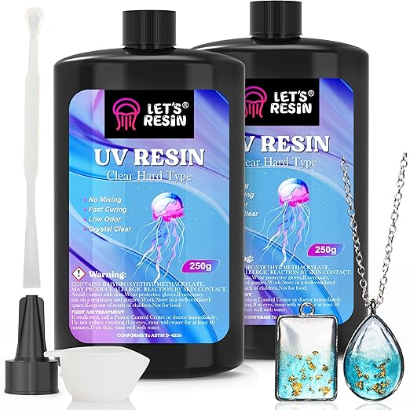 |
| [Lumière UV](https://a.co/d/ezitsoy) |  |
| [Lunettes de Protection](https://a.co/d/0IKj0s0) |  |
| [Gants de Protection](https://a.co/d/9HWPJkN) |  |
| [Manteau de Protection](https://a.co/d/4McWedg) |  |

Après l'application de la résine, et pour s'assurer que les pièces glissaient bien sur l'échiquier, j'ai utilisé du [feutre vert](https://a.co/d/2bVIOpZ).

### Pièces d'Échecs Finales

Voici le résultat final :

| Pièce d'Échecs | Handicap | Rendu 3D | Imprimé |
| - | - | - | - |
| Roi | Amputation |  |  |
| Reine | Temporaire / Post-opératoire |  |  |
| Fou | Paralysie |  |  |
| Cavalier | Cécité |  | 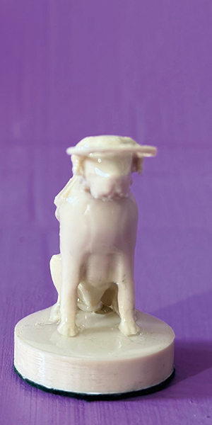 |
| Tour | Arthrite |  |  |
| Pions 1 & 2 | Trouble de la déglutition |  |  |
| Pions 3 & 4 | Handicap invisible |  |  |
| Pions 5 & 6 | Trouble anxieux |  |  |
| Pions 7 & 8 | Maladie discale dégénérative |  |  |

## Cartes

L'objectif des cartes était de rendre les handicaps affichés dans les pièces d'échecs plus clairs tout en les mettant en avant de manière positive ou neutre, non pas comme une limitation mais simplement comme faisant partie de la vie du chien.

Après avoir exploré différents styles, j'ai choisi un look orné et antique.

| Antique | Éco-Responsable | Moderne |
| - | - | - |
|  | 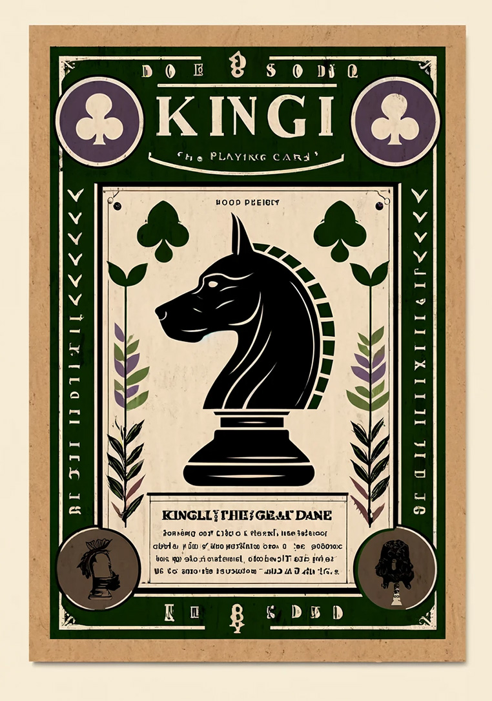 | 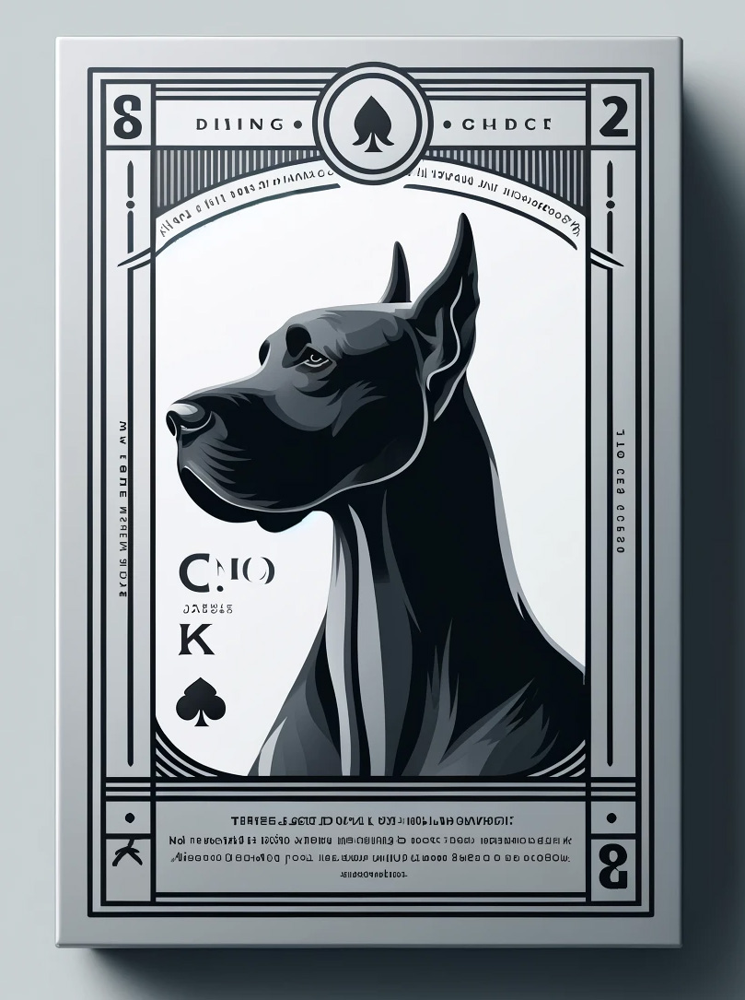 |

Comme la devise de WP Creative Pets est "Every Moment is a Training Moment", je voulais l'incorporer comme partie du jeu de cartes. Avec un peu plus d'aide de ChatGPT, j'ai obtenu la traduction approximative en latin de "Omne Momentum Disciplina Est."

    

### Polices et Design

Pour les polices, j'ai choisi Trajan Pro pour la devise et le titre car elle semblait bien s'accorder avec le style des cartes. OpenDyslexicAlta pour le corps a été choisi pour sa lisibilité et son accessibilité, particulièrement puisque tout l'objectif de cet exercice est de ne pas être limité par les handicaps.

| Trajan Pro | Open Dyslexic Alta |
| - | - |
|  |  |

### Détails des Cartes

| Pièce d'Échecs | Carte |
| - | - |
| Roi | 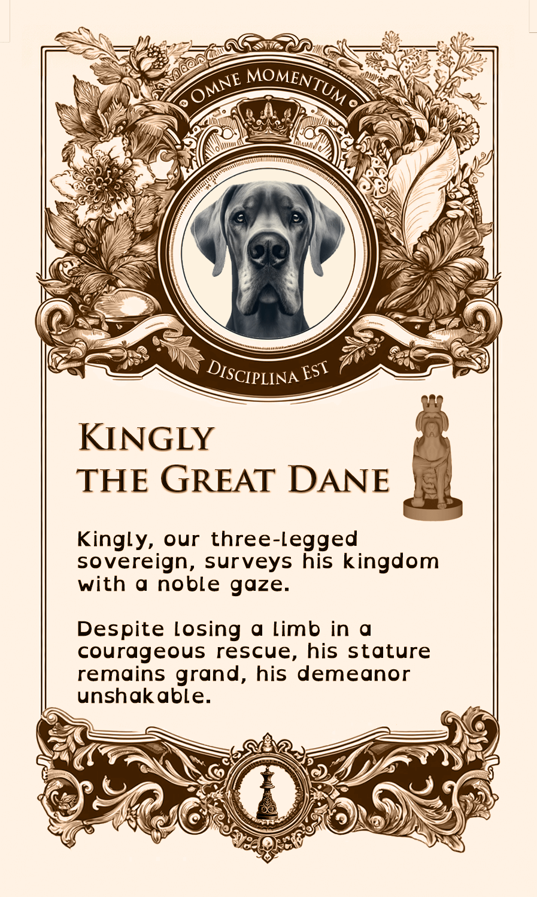 |
| Reine |  |
| Fou | 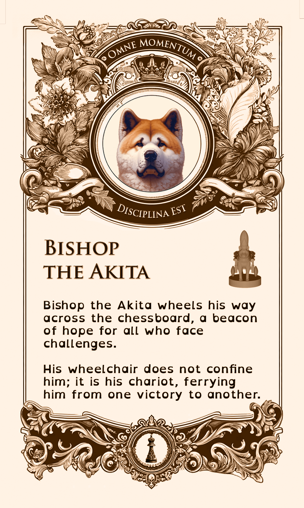 |
| Cavalier |  |
| Tour |  |
| Pions 1 & 2 |  |
| Pions 3 & 4 |  |
| Pions 5 & 6 |  |
| Pions 7 & 8 |  |

Le dos était le même pour toutes les cartes :

| Design | Imprimé |
| - | - |
|  | 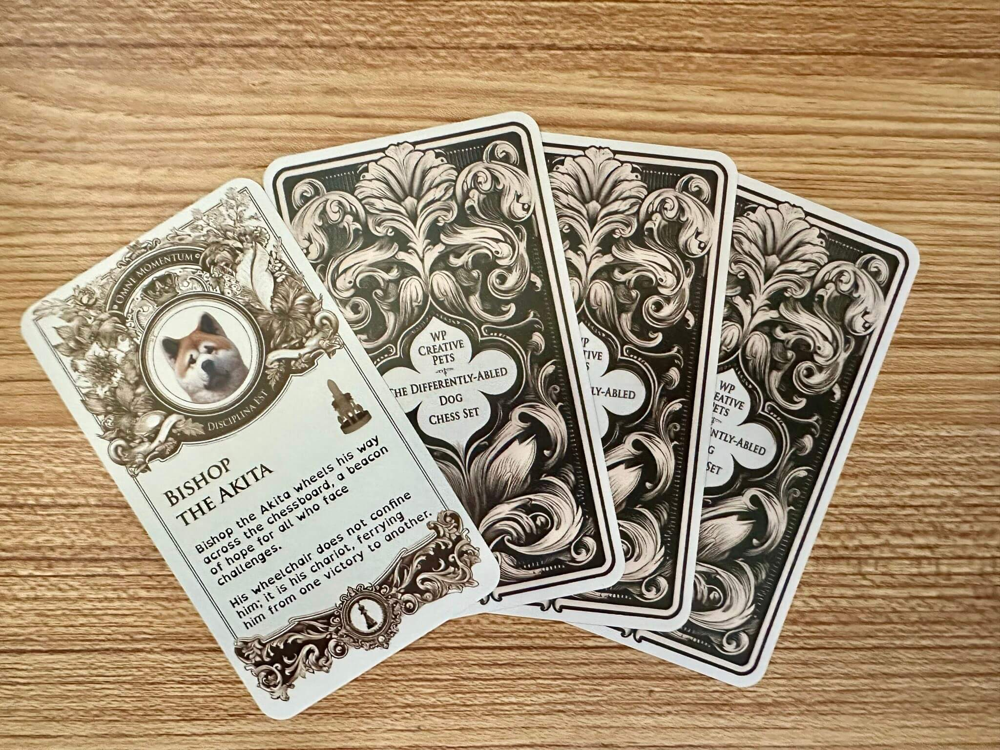 |

Une fois conçues, les cartes ont été réalisées par [MakePlayingCards.com](https://www.makeplayingcards.com/design/custom-us-game-deck-size-cards.html). Le fichier Photoshop comprenant toutes les variations de cartes et le modèle MakePlayingCards.com est disponible [ici](./assets/tarot-size.psd). Elles sont imprimées sur du plastique de haute qualité et coupées et expédiées par l'entreprise.

Une ancienne version des cartes est également disponible [ici](./assets/us_game_deck.psd), mais j'ai décidé de ne pas l'utiliser en raison de leur taille plus petite, ce qui impactait la lisibilité, et finalement, je n'étais pas satisfait de mon premier design. Si vous êtes curieux de voir à quoi elles ressemblaient, voici leur apparence :

| Imprimé | Avant | Arrière |
| - | - | - |
|  |  |  |

## Échiquier

L'échiquier est conçu pour représenter un parc à chiens, avec la moitié des cases représentant du "sable" et l'autre moitié de "l'herbe", entourées par une route.

### Conception et Construction de l'Échiquier

L'échiquier représente un parc à chiens avec des cases d'herbe et de sable, entourées par une route. Les cases ont été imprimées avec des textures détaillées pour imiter des surfaces réelles. L'échiquier est composé de quatre quadrants, chacun répété deux fois :

Représenter l'herbe a nécessité plusieurs itérations, aboutissant finalement à ce motif imprimé sous forme d'une petite série de brins fins semblables à des cheveux. Les trous étaient remplis avec les cases de sable, imprimées verticalement pour une meilleure résolution.

Une fois les quatre quadrants d'herbe imprimés et remplis avec les cases de sable, je les ai collés en place sur une plaque métallique pour leur donner un poids. J'ai utilisé de l'alliage d'aluminium 6061 de <https://www.onlinemetals.com>, qui offre des coupes sur mesure, me permettant de commander une plaque pré-découpée.

Pour la bordure, j'ai utilisé [ces cases](https://www.thingiverse.com/thing:2480607) de Thingiverse qui ressemblaient déjà à du pavé et ajouté différentes scènes avec des chiens se relaxant, jouant, et essayant d'attraper des os et des fruits.

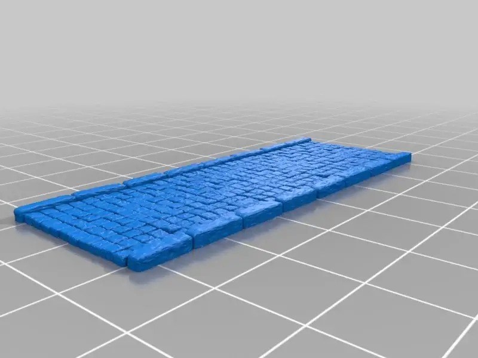

| Fosse aux Os | Voleur de Carottes | Chihuahua Détendu | Rencontre de Chiens |
| - | - | - | - |
|  | ![Gros plan sur une section de coin de l'échiquier à thème de parc à chiens, montrant des 'allées' grises détaillées avec des figurines de chiens et divers objets. Deux figurines de chien, l'une debout avec une carotte dans la bouche et l'autre assise, sont placées près de caisses remplies de nourriture. Les caisses et les chiens ajoutent une scène réaliste au coin. En arrière-plan, le motif en damier des cases 'herbe' vertes et 'sable' blanches est visible, offrant un contraste vibrant avec l'allée grise et les figurines.](./images/board/side-boxes.jpeg) |  |  |

J'ai essayé de couvrir les interstices entre les quadrants en utilisant un stylo 3D et en ponçant l'excédent, mais ils étaient encore assez visibles.

Enfin, j'ai recouvert la surface avec de la résine UV à nouveau. J'aurais aimé prendre en compte les interstices, car ils ont causé de grosses bulles. La résine chauffée a également dissous les brins d'herbe, ce qui était regrettable. Vous pouvez voir à quoi cela ressemblait avec et sans résine ci-dessous :

| Avec Résine | Sans Résine |
| - | - |
|  |  |

## Boîte de l'Échiquier

Je n'ai pas pu utiliser l'imprimante 3D pour la boîte car elle était beaucoup plus grande que l'échiquier. En faire une seule pièce solide assure qu'elle peut tenir l'échiquier de manière fiable.

Comme l'échiquier mesure 13,75"x13,75", j'ai réutilisé une boîte à pizza de 14". Je l'ai peinte en violet et j'ai pochoirisé une pièce d'échecs avec une tête de chien comme logo. Pour la protection, j'ai ajouté une couche de [polycrylique](https://a.co/d/cTNn0YK) claire. Vous pouvez voir le processus ci-dessous :

| Étape | Image |
| - | - |
| Conception Initiale |  |
| Création du Pochoir |  |
| Peinture en Spray | 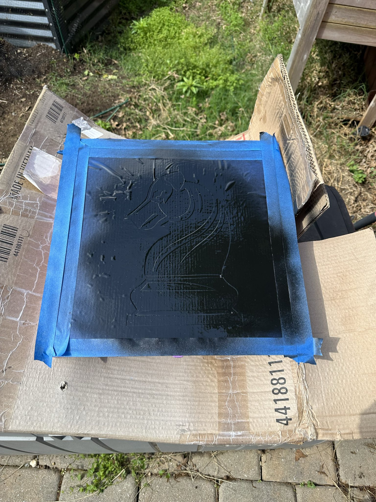 |
| Peint |  |

Pour l'intérieur, je voulais ajouter un panneau en braille puisque nous avons un chien aveugle dans le jeu d'échecs. Le texte comprend un lien vers ce post. J'ai utilisé <https://touchsee.me> pour générer les fichiers STL pour le braille contracté (Grade 2) afin que le texte indique :

| Texte Clair | Contracté | Braille | Rendu | Assemblé |
| - | - | - | - | - |
|  |  ,b>tra = ,casey ,buckley1 ,,wp ,cr1tive ,pets1 & all h} pets4 ,le>n m at3 bit4ly_/dog*ess'" /> |  |  |  |

Il a fallu plusieurs tentatives pour obtenir un texte en braille clair. Il y a aussi un code QR qui mène à cette page. Je l'ai généré en utilisant <https://printer.tools/qrcode2stl>. Malheureusement, je n'ai pas pu l'imprimer de manière à ce qu'il soit suffisamment beau pour être inclus dans l'échiquier. Finalement, j'ai fait une carte supplémentaire avec le code QR à la place.

| Rendu | Résultat | Carte |
| - | - | - |
|  |  | 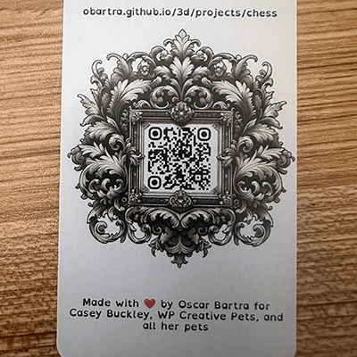 |

Pour le braille et le code QR, j'ai dû ajouter une pause pour changer le filament car mon imprimante ne prend pas en charge les impressions multi-matériaux. Pour ce faire, ajoutez `M600` au G-code généré là où la pause doit se produire. Si vous êtes curieux de savoir ce qui se passe lorsque vous ajoutez la pause au mauvais calque, vous pouvez le voir ici :

![Une photographie d'une impression 3D ratée d'un panneau en braille sur une surface en bois. L'impression présente une couche supérieure noire avec des points en braille visibles, mais le changement de couleur a été appliqué incorrectement, ce qui a entraîné l'utilisation du filament noir sur la dernière couche de la partie de base au lieu du calque prévu. Le panneau est bordé d'un cadre violet, et la surface semble inégale et désordonnée en raison du problème de changement de couleur des calques. Le texte en braille est difficile à lire en raison du changement de couleur de calque incorrect.](./images/braille/attempt-layer.png)

Enfin, j'ai utilisé le même feutre que pour les pièces d'échecs pour recouvrir le fond de l'intérieur de la boîte.

## Boîte des Pièces

Pour garder les pièces organisées et protégées, j'ai conçu une boîte personnalisée. Elle est un peu encombrante mais je voulais que le support à l'intérieur double comme un présentoir pour les pièces afin qu'elles puissent être plus facilement exposées. La boîte est un cube carré avec un insert à l'intérieur destiné à minimiser le mouvement des pièces. L'avant de la boîte a un couvercle qui se glisse et présente la même image de pièce d'échecs de chien que nous avons pochoirisée pour la boîte de l'échiquier.

| Design | Ouvert | Partiellement Ouvert | Fermé |
| - | - | - | - |
| 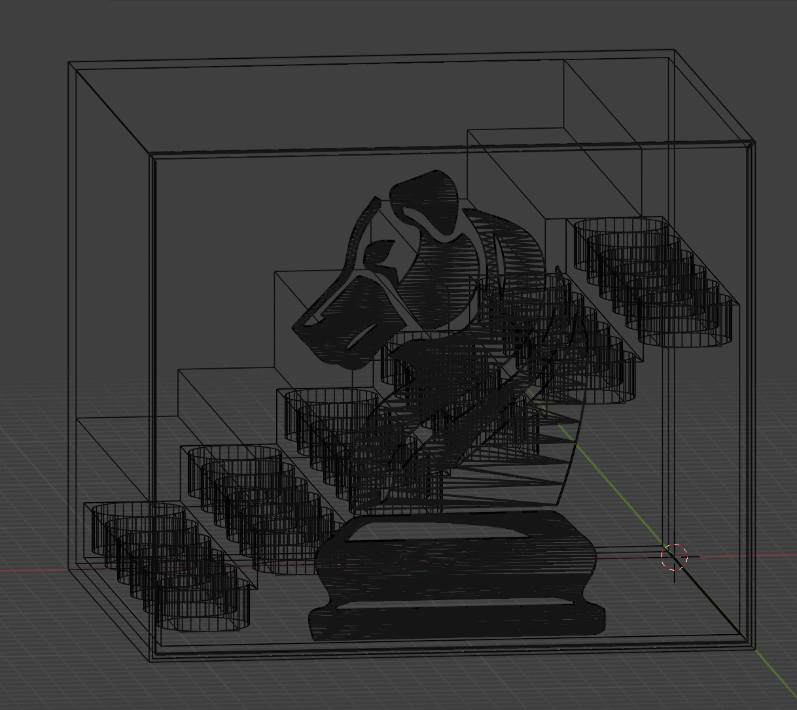 |  |  | 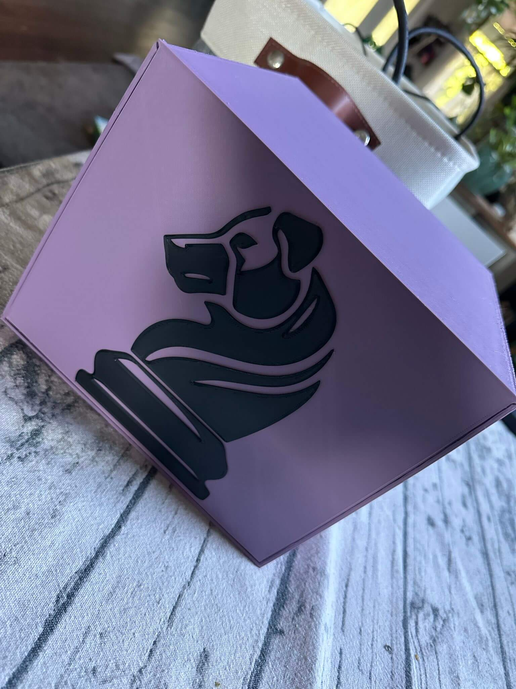 |

### Résumé

Et voilà ! Merci de prendre le temps de lire sur le Jeu d'Échecs Différemment Capable.

| Cartes | Pièces d'Échecs | Échiquier | Boîte de l'Échiquier | Boîte des Pièces |
| - | - | - | - | - |
|  | 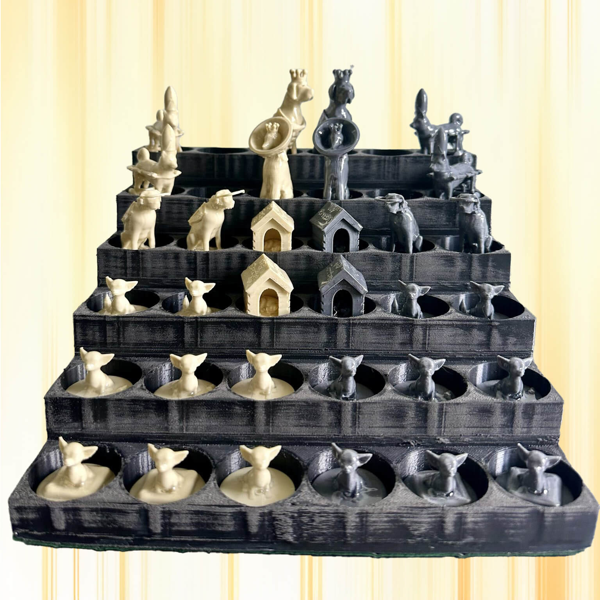 |  |  |  |

Si vous voulez laisser un commentaire ou une suggestion, vous pouvez le faire [ici](https://github.com/obartra/3d/issues/new).

