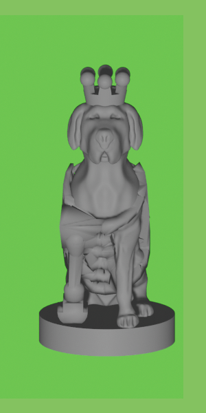
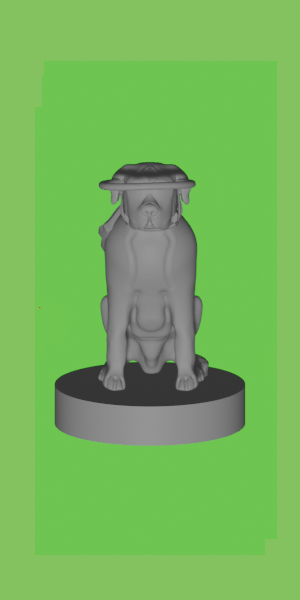
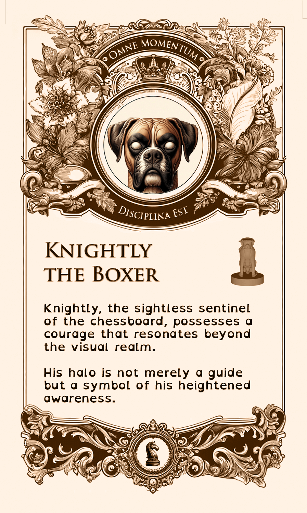
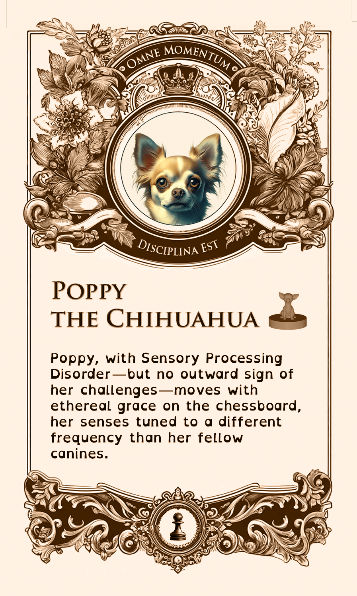

# The Differently-abled Chess Set

This project is a tribute to our dog trainer, Casey Buckley who runs [WP Creative Pets](https://www.wpcreativepets.com/). If you have a dog, particularly a reactive dog, and are in the Philadelphia area, you won't find a better trainer. She readily adapts to different teaching styles, is trauma informed, queer friendly, and extremely talented.

Our doggo, Iroh, had a some anxiety issues that we weren't able to overcome until we contacted her. Here he is now, being a good boy:

    

As a thank you for her tireless work, I wanted to build a 3d project that doubled as practice for myself, as I'm learning 3D printing, and honored her work. I know she collects unique chess sets so I decided to build her a custom chess set for dogs with disabilities. It was important to me that these were displayed with normalcy and focusing on the positive rather than any limiting aspects since that would more accurately capture her focus and her work.

I found [this chess set](https://www.thingiverse.com/thing:5590380) in Thingiverse that was both adorable and a great starting point.

    

Next step was to figure out which disabilities to highlight. I used ChatGPT to figure out a diverse list of disabilities to make the set as inclusive as possible while keeping it recognizable in the chess pieces. In the end, I chose to also include a card with each piece to make sure the intent was clear.

Here is the final result:

| Chess Piece | Disability | 3d Render | Printed | Card |
| - | - | - | - | - |
| King | Amputation |  |  |  |
| Queen | Temporary / Post-Surgery |  |  |  |
| Bishop | Paralysis |  |  |  |
| Knight | Blindness |  |  |  |
| Rook | Arthritis |  |  |  |
| Pawns 1 & 2 | Swallowing Disorder |  |  |  |
| Pawns 3 & 4 |  Invisible Disability |  |  |  |
| Pawns 5 & 6 | Anxiety Disorder |  |  |  |
| Pawns 7 & 8 | Degenerative Disc |  |  |  |

## Cards

The goal of the cards was to make the disabilities clear and highlight them in a positive or neutral way, not as a limitation but simply part of the dogs life.

Since WP Creative Pets moto is "Every Moment is a Training Moment" I wanted to incorporate it as part of the card set. With some ChatGPT we got to the approximate latin translation of "Omne Momentum Disciplina Est".

    

Font-wise I choose Trajan Pro for both the moto and the title since it seemed to pair well with Roboto for the body. There, legibility was the main concern, particularly since the cards are already small and the whole point of this exercise is accessibility / not being limited by disabilities.

| Trajan Pro | Roboto |
| - | - |
|  |  |

The rest of the card art was generated with ChatGPT and edited in Photoshop for styling consistency. The back was the same for all cards:

    

Once designed, the cards were made by [MakePlayingCards.com](https://www.makeplayingcards.com/design/custom-us-game-deck-size-cards.html). The Photoshop file including all card variations and the MakePlayingCards.com template is available [here](./assets/us_game_deck.psd). For around $20, they printed on high quality plastic and cut and shipped the cards.

