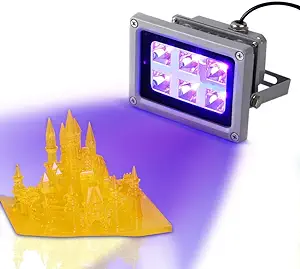
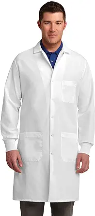
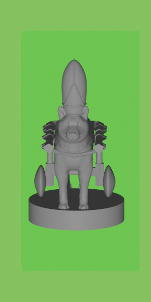
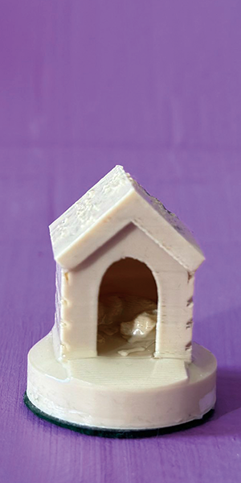
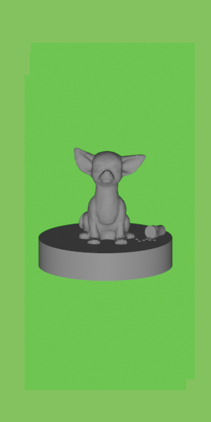
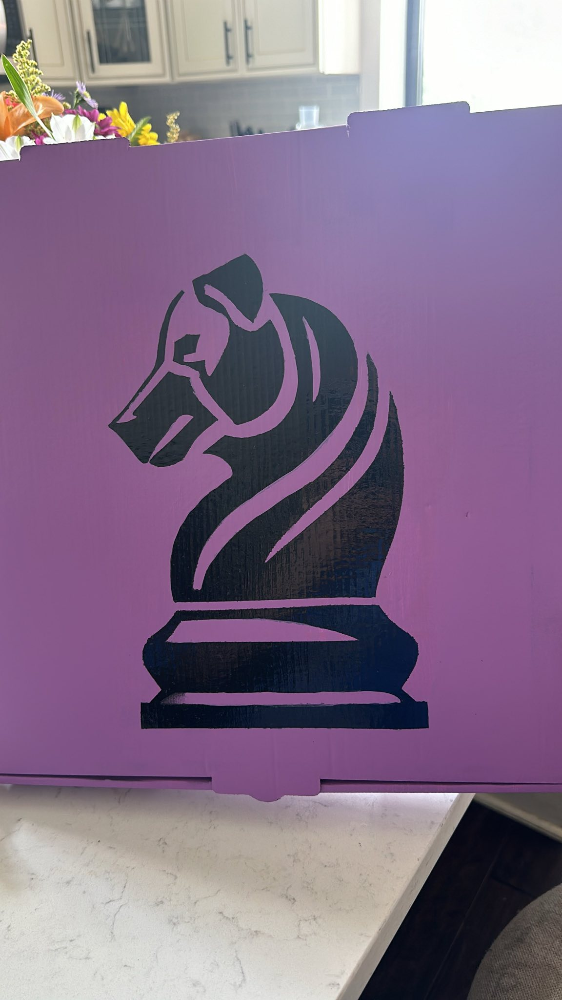
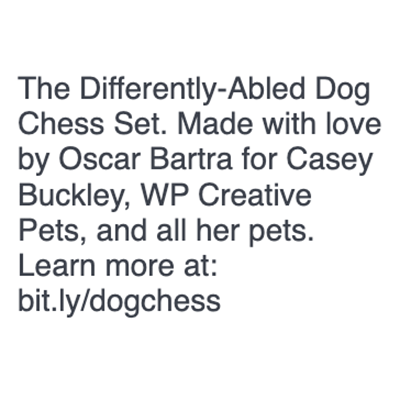
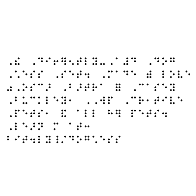
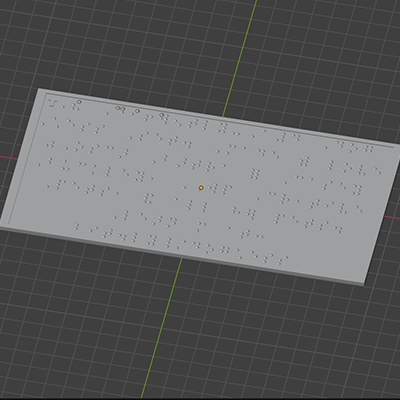

# The Differently-abled Chess Set

This project is a tribute to our dog trainer, Casey Buckley, who runs [WP Creative Pets](https://www.wpcreativepets.com/). If you have a dog, especially a reactive one, and are in the Philadelphia area, you won't find a better trainer. She readily adapts to different teaching styles, is trauma-informed, queer-friendly, and extremely talented.

## Background

Our dog, Iroh, had some anxiety issues that we couldn't overcome until we contacted her. Here he is now, being a good boy:

<p align="center">
    
</p>

As a thank you for her tireless work, I wanted to create a 3D project that served both as practice for myself, as I'm learning 3D printing, and to honor her work. Knowing she collects unique chess sets, I decided to build her a custom chess set featuring dogs with disabilities. It was important that these were displayed with normalcy and focusing on the positive rather than any limiting aspects since that would more accurately capture her focus and her work.

## Chess Pieces

I found [this chess set](https://www.thingiverse.com/thing:5590380) on Thingiverse that was both adorable and a great starting point.

<p align="center">
    
</p>

### 3D Model Ideation and Design

The next step was to figure out which disabilities to highlight. I used ChatGPT to create a diverse list of disabilities to make the set as inclusive as possible while keeping it recognizable in the chess pieces.

| Chess Piece | Disability | Adaptive Aid |
| - | - | - |
| King | Front leg amputee | Prosthetic leg |
| Queen | Temporary disability (Post-Surgery) | Cone |
| Bishop | Paralysis | Wheelchair |
| Knight | Blindness | Halo |
| Rook | Arthritis | Ramp, Orthopedic mat |
| Pawns 1 & 2 | Swallowing disorder | Feeding bottle |
| Pawns 3 & 4 | Invisible disability | N/A |
| Pawns 5 & 6 | Anxiety disorder | Medication |
| Pawns 7 & 8 | Degenerative disc disease | Orthopedic bed |

The next step was to figure out how to represent these disabilities in the models. I incorporated some additional designs from Thingiverse into the project and created the rest.

For instance, the bishop's wheelchair was based on [this model](https://www.thingiverse.com/thing:1397964):


The final rendering looked like this:


### 3D Printing Process

I wanted them to feel heavy, so I printed them with a full infill. I used a small (0.12mm) layer height to capture the small details from the model as well as possible.

It took a couple of iterations to figure out how to best print them; some, like the king and the bishop, printed better without supports. Others, like the queen (for the cone) and the knight (for the halo), needed them.

Since many had delicate details (like the knight's halo), I decided to coat them in transparent UV resin to increase their strength.

### Using UV Resin

If you haven’t used UV resin before (like me), the process is straightforward but requires some preparation. It’s important you never look directly into the UV light (to avoid risk of blindness) and ensure the resin doesn’t touch your skin. So, to be safe, you’ll need some gear:

| Material | Image |
| - | - |
| [UV resin](https://a.co/d/ezitsoy) |  |
| [UV light](https://a.co/d/ezitsoy) |  |
| [Protective Goggles](https://a.co/d/0IKj0s0) |  |
| [Protective Gloves](https://a.co/d/9HWPJkN) |  |
| [Protective Coat](https://a.co/d/4McWedg) |  |

With it, we are ready to science! The resin will have a specific curing time; check the bottle and follow instructions. You’ll want to cure it until it’s dry enough that touching it with the gloves doesn’t leave any prints but not longer to avoid overcuring.

After the resin was applied, and to make sure the pieces glided through the chessboard nicely, I used [green felt](https://a.co/d/2bVIOpZ).

### Final Chess Pieces

Here is the final result:

| Chess Piece | Disability | 3D Render | Printed |
| - | - | - | - |
| King | Amputation |  |  |
| Queen | Temporary / Post-Surgery |  |  |
| Bishop | Paralysis |  |  |
| Knight | Blindness |  |  |
| Rook | Arthritis |  |  |
| Pawns 1 & 2 | Swallowing Disorder |  |  |
| Pawns 3 & 4 | Invisible Disability |  |  |
| Pawns 5 & 6 | Anxiety Disorder |  |  |
| Pawns 7 & 8 | Degenerative Disc |  |  |

## Cards

The goal of the cards was to make the disabilities displayed in the chess pieces more clear while highlighting them in a positive or neutral way, not as a limitation but simply part of the dog's life.

I used ChatGPT to get inspiration in different styles
; ultimately, I went with the ornate, antique look:

| Antique | Eco-Friendly | Modern |
| - | - | - |
|  |  |  |

Since WP Creative Pets' motto is "Every Moment is a Training Moment," I wanted to incorporate it as part of the card set. With some more ChatGPT help, I got to the approximate Latin translation of "Omne Momentum Disciplina Est."

<p align="center">
    
</p>

### Fonts and Design

Font-wise, I chose Trajan Pro for both the motto and the title since it seemed to pair well with the card style. OpenDyslexicAlta for the body was chosen for legibility and accessibility, particularly since the whole point of this exercise is to not be limited by disabilities.

| Trajan Pro | Open Dyslexic Alta |
| - | - |
|  |  |

### Card Details

| Chess Piece | Card |
| - | - |
| King |  |
| Queen |  |
| Bishop |  |
| Knight |  |
| Rook |  |
| Pawns 1 & 2 |  |
| Pawns 3 & 4 |  |
| Pawns 5 & 6 |  |
| Pawns 7 & 8 |  |

The back was the same for all cards:

<p align="center">
    
</p>

Once designed, the cards were made by [MakePlayingCards.com](https://www.makeplayingcards.com/design/custom-us-game-deck-size-cards.html). The Photoshop file including all card variations and the MakePlayingCards.com template is available [here](./assets/tarot-size.psd). They printed on high-quality plastic and cut and shipped the cards.

An older iteration of the cards is also available [here](./assets/us_game_deck.psd), but I decided against it due to their smaller size, which impacted readability, and ultimately, I wasn't happy with my first design. If you are curious about it, this is how they looked:

| Printed | Front | Back |
| - | - | - |
|  |  |  |

## Board

The chessboard is designed to represent a dog park, with half the tiles representing "sand" and the other half "grass," surrounded by a road.

### Board Design and Construction

The chessboard is composed of four quadrants, each repeated twice:


Representing the grass required several iterations, finally landing on this pattern that printed as a small series of thin, hair-like strands:


Other approaches worked well for printing faux grass at a larger scale but not for the dimensions needed for the chess tiles. The holes were filled with the sand tiles, which were printed vertically to increase the resolution of the sand (since the printer has higher resolution on the Z axis).


Once the four grass quadrants were printed and filled with the sand tiles, they were glued in place. Since the board tiles were fairly hollow, I glued them on top of a metal sheet to give them a weighted feel. I used <https://www.onlinemetals.com>, which offers custom cuts, allowing me to order a pre-cut sheet.

Using ChatGPT, I determined that a 6061 Aluminum alloy was the best-suited material. It is strong enough to support the board without bending and adds some extra weight, while being affordable. The final dimensions were roughly half the size of a standard chessboard at 13.75"x13.75".


For the border, I used [these tiles](https://www.thingiverse.com/thing:2480607) from Thingiverse that already looked like pavement and added different scenes with dogs relaxing, playing, and trying to grab some bones and fruit.


| Bone Pit | Carrot Thief | Chilling Chihuahua | Dog Meeting |
| - | - | - | - |
|  |  |  |  |

I tried to cover the gaps between the quadrants using a 3D pen and sanding the excess, but they were still fairly visible.

Finally, I covered the surface using UV resin again. I wish I had taken into account the gaps because they caused some large bubbles. The heated resin also dissolved the grass threads, which was unfortunate. You can see how it looked with and without resin below:

| With Resin | Without Resin |
| - | - |
|  |  |

## Box

I couldn't use the 3D printer for the box since it was much larger than the chessboard. Making it a single solid piece ensures it can reliably hold the chessboard.

Since the chessboard is 13.75"x13.75", I repurposed a 14" pizza box. I painted it purple and stenciled a chess piece with a dog head as a logo. For protection, I added a clear [polycrylic](https://a.co/d/cTNn0YK) coat. You can see the process below:

| Step | Image |
| - | - |
| Initial Design |  |
| Create stencil |  |
| Spray Paint |  |
| Painted |  |

For the inside, I wanted to add a Braille sign since we have a blind dog in the chess set. The text includes a link to this post. I used <https://touchsee.me> to generate the STL files for contracted (Grade 2) Braille so the text reads:

| Plain Text | Contracted | Braille | Render |
| - | - | - | - |
|  |  ,b>tra = ,casey ,buckley1 ,,wp ,cr1tive ,pets1 & all h} pets4 ,le>n m at3 bit4ly_/dog*ess'" /> |  |  |

There's also a QR code that links to this page. I generated it using <https://printer.tools/qrcode2stl>.


For both the Braille and QR code, we need to add a pause to change the filament since my printer doesn't support multi-material prints. We can do so by adding `M600` to the generated G-code. For example, to add a pause between layers 29 and 30, we would do:

```gcode
;LAYER:29
G1 X50.0 Y25.0 Z5.8 F9000 ; move to a position
G1 F1800 E0 ; extrusion command
; more commands for layer 29

; Insert the pause command here
M600 ; Pause to change filament

;LAYER:30
G1 X55.0 Y30.0 Z6.0 F9000 ; move to start of layer 30
G1 F1800 E0 ; extrusion command
; commands for layer 30
```

Lastly, I used the same felt as for the chess pieces to cover the bottom of the inside of the box.

TODO: Add inside image

## Pieces Holder

To keep the pieces organized and protected, I designed a custom holder. It was meant to be transparent, using transparent filament, but given the complexity of the box design, it ended up being just translucent. I tried minimizing the infill, making it concentric with different layer heights. I also did some long acetone vapor baths, but in the end, none of these options seemed to make much of a difference. I suspect a single-wall design would have been the only option, but it was not feasible for the box if it was meant to hold the pieces in place.

### Call to Action

Thank you for taking the time to read about the Differently-abled Chess Set. If you have any questions or feedback, please reach out.
