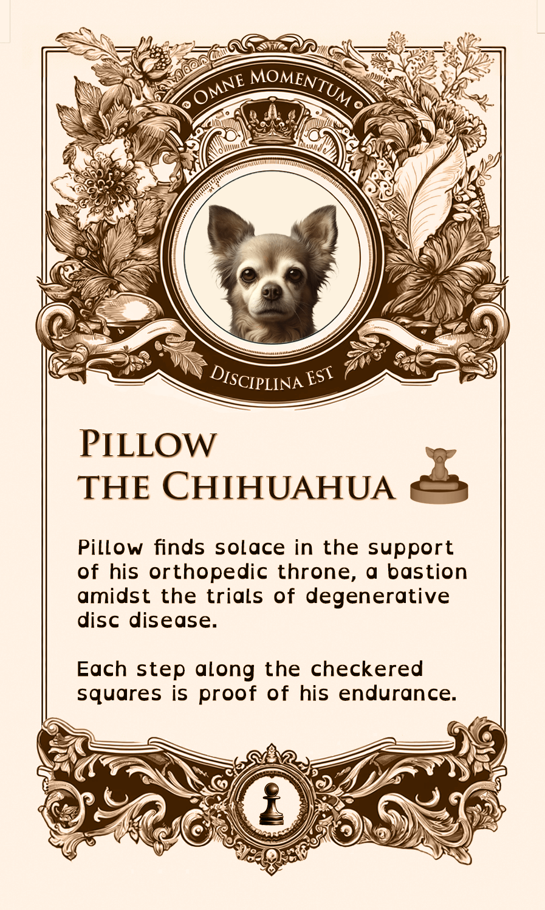

# The Differently-abled Chess Set

This project is a tribute to our dog trainer, Casey Buckley who runs [WP Creative Pets](https://www.wpcreativepets.com/). If you have a dog, particularly a reactive dog, and are in the Philadelphia area, you won't find a better trainer. She readily adapts to different teaching styles, is trauma informed, queer friendly, and extremely talented.

Our doggo, Iroh, had a some anxiety issues that we weren't able to overcome until we contacted her. Here he is now, being a good boy:

    

As a thank you for her tireless work, I wanted to build a 3d project that doubled as practice for myself, as I'm learning 3D printing, and honored her work. I know she collects unique chess sets so I decided to build her a custom chess set for dogs with disabilities. It was important to me that these were displayed with normalcy and focusing on the positive rather than any limiting aspects since that would more accurately capture her focus and her work.

## Chess Pieces

I found [this chess set](https://www.thingiverse.com/thing:5590380) in Thingiverse that was both adorable and a great starting point.

    

Next step was to figure out which disabilities to highlight. I used ChatGPT to figure out a diverse list of disabilities to make the set as inclusive as possible while keeping it recognizable in the chess pieces.

| Chess Piece | Disability
| - | - |
| King | Front leg amputatee |
| Queen | Temporary disability, Post-Surgery / Cone |
| Bishop | Paralysis |
| Knight | Blindness |
| Rook | Arthritis |
| Pawns 1 & 2 | Swallowing Disorder |
| Pawns 3 & 4 |  Invisible Disability |
| Pawns 5 & 6 | Anxiety Disorder |
| Pawns 7 & 8 | Degenerative Disc |

Next step was to figure out how to represent these disabilities in the models. I was able to incorporate many additional designs from thingiverse into it, reducing the need for creating custom pieces which was great for my limited 3d editing skills.

For instance, the bishop's wheelchair was based off [this model](https://www.thingiverse.com/thing:1397964):

The final rendering looked like this:

I wanted them to feel heavy so I printed them with a full infill. I used a small (0.12mm) layer height to try to capture the small details from the model as well as possible. Since many they had delicate details (like the knight's halo) I decided to coat them in [transparent UV resin](https://a.co/d/2bVIOpZ) to increase their strength.

To make sure they glided through the chessboard nicely, I used [green felt](https://a.co/d/2bVIOpZ).

Here is the final result:

| Chess Piece | Disability | 3d Render | Printed |
| - | - | - | - |
| King | Amputation |  |  |
| Queen | Temporary / Post-Surgery |  |  |
| Bishop | Paralysis |  |  |
| Knight | Blindness |  |  |
| Rook | Arthritis |  |  |
| Pawns 1 & 2 | Swallowing Disorder |  |  |
| Pawns 3 & 4 |  Invisible Disability |  |  |
| Pawns 5 & 6 | Anxiety Disorder |  |  |
| Pawns 7 & 8 | Degenerative Disc |  |  |

## Cards

The goal of the cards was to make the disabilities displayed in the chess pieces more clear while highlighting them in a positive or neutral way, not as a limitation but simply part of the dogs life.

I used ChatGPT to get inspiration in different styles, ultimately I went with the ornate, antique look:

| Antique | Eco-Friendly | Modern |
| - | - | - |
|  |  |  |

Since WP Creative Pets moto is "Every Moment is a Training Moment" I wanted to incorporate it as part of the card set. With some more ChatGPT help, I got to the approximate latin translation of "Omne Momentum Disciplina Est".

    

Font-wise I choose Trajan Pro for both the moto and the title since it seemed to pair well with the card style. OpenDyslexicAlta for the body was choosen for legibility and accessibility, particularly since the whole point of this exercise is to not be limited by disabilities.

| Trajan Pro | Open Dyslexic Alta |
| - | - |
|  |  |

| Chess Piece | Card |
| - | - |
| King |  |
| Queen |  |
| Bishop |  |
| Knight |  |
| Rook | |
| Pawns 1 & 2 |  |
| Pawns 3 & 4 |  |
| Pawns 5 & 6 |  |
| Pawns 7 & 8 |  |

The back was the same for all cards:

    

Once designed, the cards were made by [MakePlayingCards.com](https://www.makeplayingcards.com/design/custom-us-game-deck-size-cards.html). The Photoshop file including all card variations and the MakePlayingCards.com template is available [here](./assets/tarot-size.psd). They printed on high quality plastic and cut and shipped the cards.

An older iteration of the cards is also available [here](./assets/us_game_deck.psd) but decided against it due to their smaller size which impacted readability, and, ultimately, I wasn't happy with my first design. If you are curious about it, this is how they looked like:

