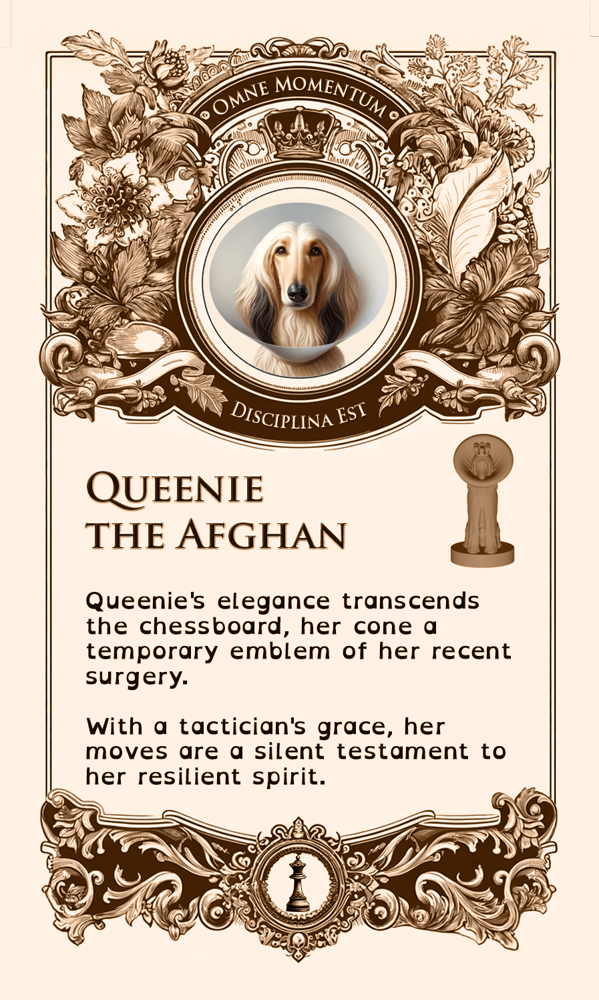
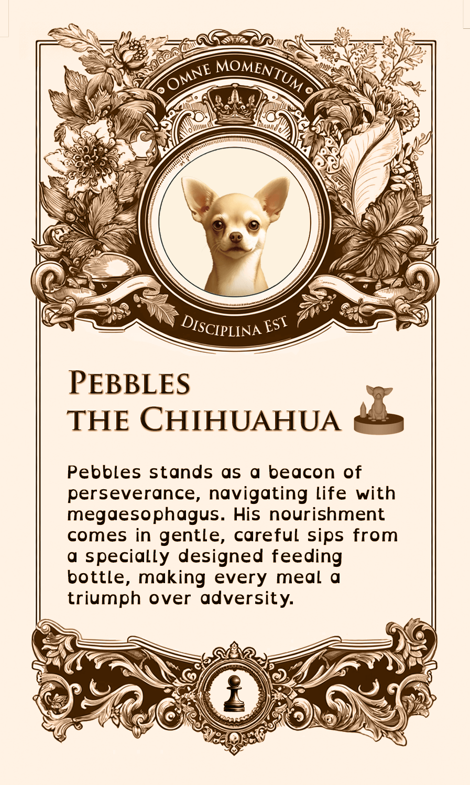

# The Differently-abled Chess Set

This project is a tribute to our dog trainer, Casey Buckley, who runs [WP Creative Pets](https://www.wpcreativepets.com/). If you have a dog, particularly a reactive dog, and are in the Philadelphia area, you won't find a better trainer. She readily adapts to different teaching styles, is trauma-informed, queer-friendly, and extremely talented.

## Background

Our doggo, Iroh, had some anxiety issues that we weren't able to overcome until we contacted her. Here he is now, being a good boy:

    

As a thank you for her tireless work, I wanted to create a 3D project that served both as practice for myself, as I'm learning 3D printing, and to honor her work. Knowing she collects unique chess sets, I decided to build her a custom chess set for dogs with disabilities. It was important to me that these were displayed with normalcy and focusing on the positive rather than any limiting aspects since that would more accurately capture her focus and her work.

## Chess Pieces

I found [this chess set](https://www.thingiverse.com/thing:5590380) on Thingiverse that was both adorable and a great starting point.

    

### 3D Model Ideation and Design

The next step was to figure out which disabilities to highlight. I used ChatGPT to create a diverse list of disabilities to make the set as inclusive as possible while keeping it recognizable in the chess pieces.

| Chess Piece | Disability | Adaptive Aid |
| - | - | - |
| King | Front leg amputee | Prosthetic leg |
| Queen | Temporary disability (Post-Surgery) | Cone |
| Bishop | Paralysis | Wheelchair |
| Knight | Blindness | Halo |
| Rook | Arthritis | Ramp, Orthopedic mat |
| Pawns 1 & 2 | Swallowing disorder | Feeding bottle |
| Pawns 3 & 4 | Invisible disability | N/A |
| Pawns 5 & 6 | Anxiety disorder | Medication |
| Pawns 7 & 8 | Degenerative disc disease | Orthopedic bed |

Next step was to figure out how to represent these disabilities in the models. I was able to incorporate some additional designs from Thingiverse into it and create the rest.

For instance, the bishop's wheelchair was based off [this model](https://www.thingiverse.com/thing:1397964):

The final rendering looked like this:

### 3D Printing Process

I wanted them to feel heavy, so I printed them with a full infill. I used a small (0.12mm) layer height to try to capture the small details from the model as well as possible.

It took a couple of iterations to figure out how to best print them; some, like the king and the bishop, printed better without supports. Others, like the queen (for the cone) and the knight (for the halo), needed them.

Since many had delicate details (like the knight's halo), I decided to coat them in transparent UV resin to increase their strength.

### Using UV Resin

If you haven’t used UV resin before (like me), the process is straightforward but requires some preparation. It’s important you never look directly into the UV light (to avoid risk of blindness) and ensure the resin doesn’t touch your skin. So, to be safe, you’ll need some gear:

| Material | Image |
| - | - |
| [UV resin](https://a.co/d/ezitsoy) |  |
| [UV light](https://a.co/d/ezitsoy) |  |
| [Protective Goggles](https://a.co/d/0IKj0s0) |  |
| [Protective Gloves](https://a.co/d/9HWPJkN) |  |
| [Protective Coat](https://a.co/d/4McWedg) |  |

With it, we are ready to science! The resin will have a specific curing time; check the bottle and follow instructions. You’ll want to cure it until it’s dry enough that touching it with the gloves doesn’t leave any prints but not longer to avoid overcuring.

After the resin was applied, and to make sure the pieces glided through the chessboard nicely, I used [green felt](https://a.co/d/2bVIOpZ).

### Final Chess Pieces

Here is the final result:

| Chess Piece | Disability | 3d Render | Printed |
| - | - | - | - |
| King | Amputation |  |  |
| Queen | Temporary / Post-Surgery |  |  |
| Bishop | Paralysis |  |  |
| Knight | Blindness |  |  |
| Rook | Arthritis |  |  |
| Pawns 1 & 2 | Swallowing Disorder |  |  |
| Pawns 3 & 4 | Invisible Disability |  |  |
| Pawns 5 & 6 | Anxiety Disorder |  |  |
| Pawns 7 & 8 | Degenerative Disc |  |  |

## Cards

The goal of the cards was to make the disabilities displayed in the chess pieces more clear while highlighting them in a positive or neutral way, not as a limitation but simply part of the dog's life.

I used ChatGPT to get inspiration in different styles; ultimately, I went with the ornate, antique look:

| Antique | Eco-Friendly | Modern |
| - | - | - |
|  |  |  |

Since WP Creative Pets' motto is "Every Moment is a Training Moment," I wanted to incorporate it as part of the card set. With some more ChatGPT help, I got to the approximate Latin translation of "Omne Momentum Disciplina Est."

    

### Fonts and Design

Font-wise, I chose Trajan Pro for both the motto and the title since it seemed to pair well with the card style. OpenDyslexicAlta for the body was chosen for legibility and accessibility, particularly since the whole point of this exercise is to not be limited by disabilities.

| Trajan Pro | Open Dyslexic Alta |
| - | - |
|  |  |

### Card Details

| Chess Piece | Card |
| - | - |
| King |  |
| Queen |  |
| Bishop |  |
| Knight |  |
| Rook | |
| Pawns 1 & 2 |  |
| Pawns 3 & 4 |  |
| Pawns 5 & 6 |  |
| Pawns 7 & 8 |  |

The back was the same for all cards:

    

Once designed, the cards were made by [MakePlayingCards.com](https://www.makeplayingcards.com/design/custom-us-game-deck-size-cards.html). The Photoshop file including all card variations and the MakePlayingCards.com template is available [here](./assets/tarot-size.psd). They printed on high-quality plastic and cut and shipped the cards.

An older iteration of the cards is also available [here](./assets/us_game_deck.psd), but I decided against it due to their smaller size, which impacted readability, and ultimately, I wasn't happy with my first design. If you are curious about it, this is how they looked:

| Printed | Front | Back |
| - | - | - |
|  |  |  |

## Board

The chess board was meant to represent a dog park, with half the tiles representing "sand" and the other half "grass," with a road surrounding the board.

### Board Design and Construction

(add details about the materials, design considerations, and construction process for the chess board, including any challenges faced and how they were overcome.)

## Box

The box for the chess set needed to be as special as the pieces themselves. I decided to create a puzzle box that would not only store the pieces securely but also add an element of fun and intrigue.

### Box Design

(Discuss the design considerations for the box, including the choice of materials, any unique features, and how it complements the chess set. Mention the tools and techniques used in the construction.)

### Box Construction

(Detail the step-by-step process of constructing the box, including any challenges faced and how they were overcome. Include images or diagrams if available.)

## Holder

To keep the pieces organized and protected, I designed a custom holder. This holder needed to accommodate the unique shapes and sizes of the pieces while providing easy access.

### Holder Design

(Discuss the design considerations for the holder, including the choice of materials, any unique features, and how it complements the chess set and box. mention the tools and techniques used in the construction.)

### Holder Construction

(Detail the step-by-step process of constructing the holder, including any challenges faced and how they were overcome. Include images or diagrams if available.)

### Call to Action

Thank you for taking the time to read about the Differently-abled Chess Set. If you have any questions, or feedback, please reach out.